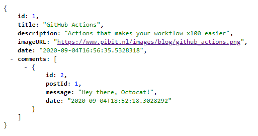

# ASP.NET Blog API
Blog API built in ASP.NET Core

### Docs


### API Response

<p align="center">
    
    
</P>

### Database Diagram

<p align="center">
    
</p>

### Apply Migrations
The following updates your database to the latest migration. Run command on Visual Studio Package Manager Console

```
PM> Update-Database
```